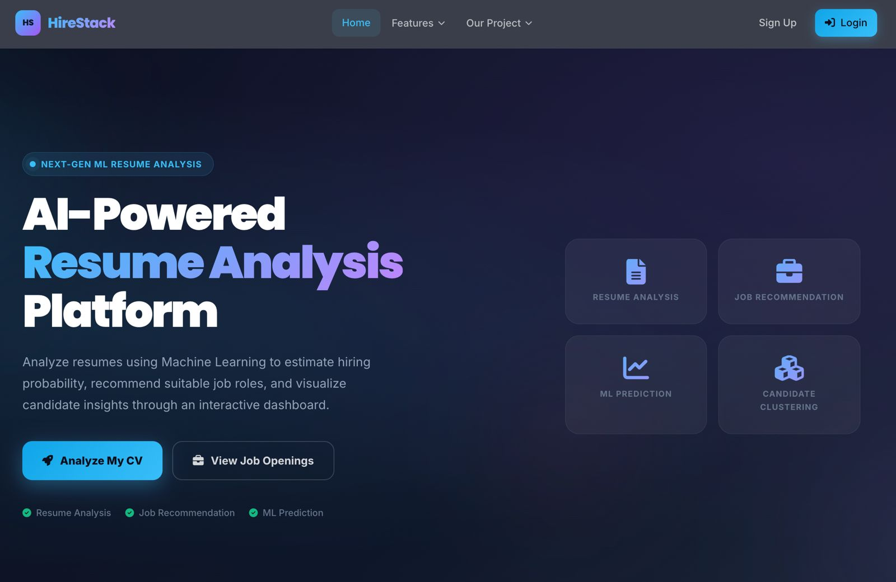
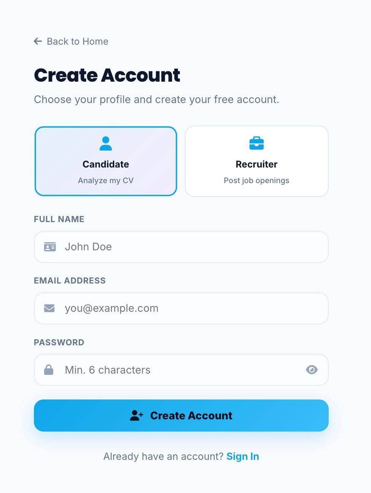
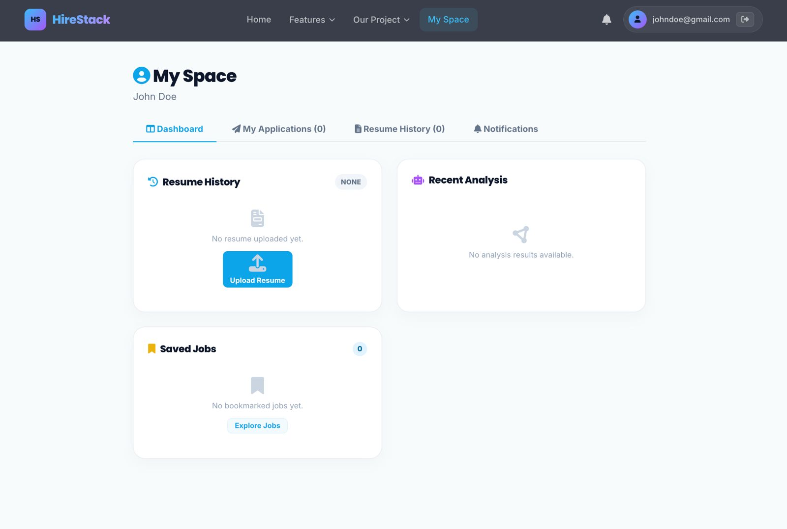
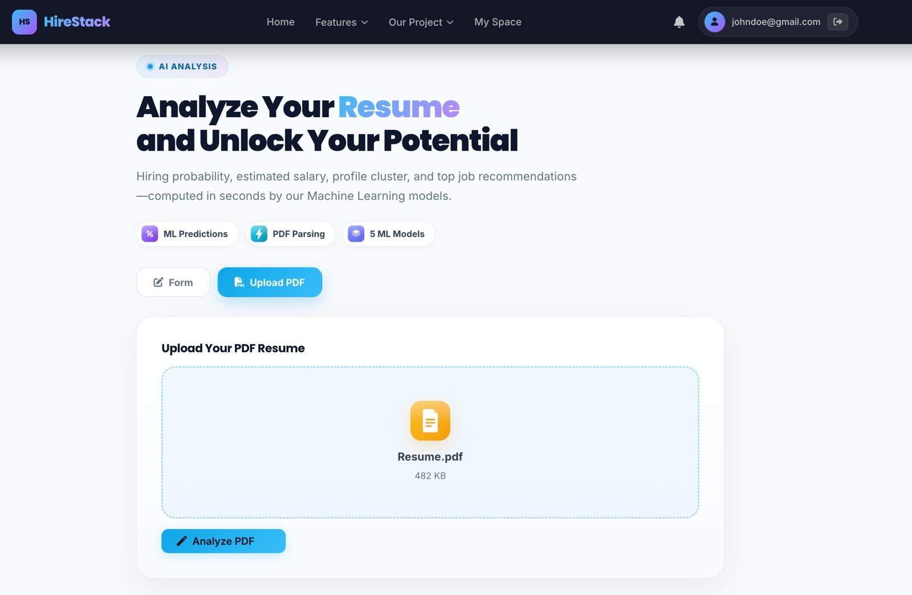
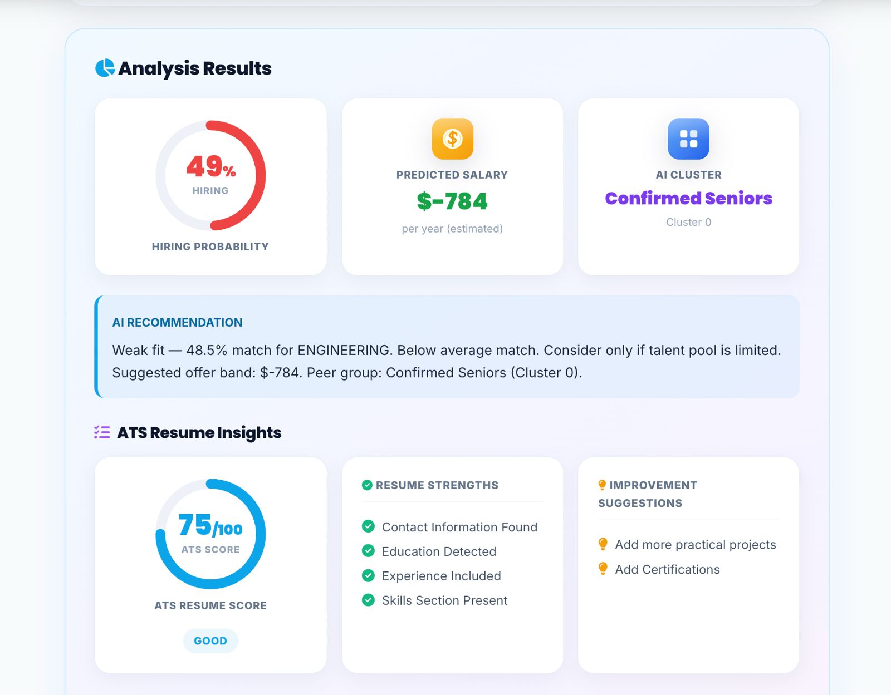
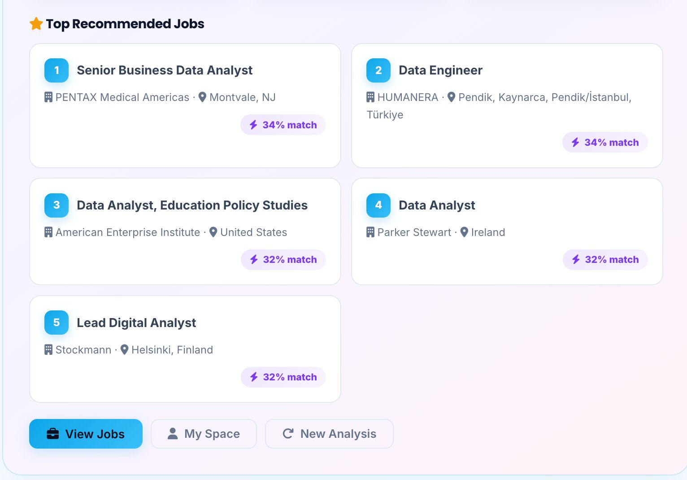
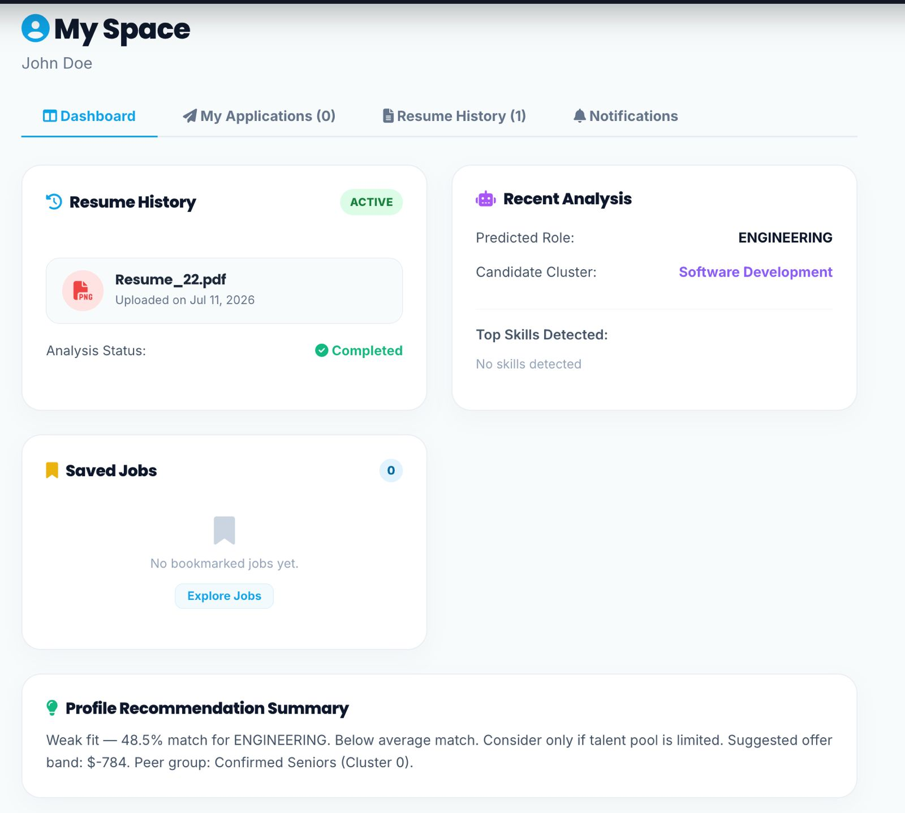

# 🚀 HireStack AI

An AI-powered Resume Analysis Platform that analyzes resumes using Machine Learning to predict hiring probability, estimate salary, classify candidate profiles, and recommend suitable jobs.

---

## 📌 Overview

HireStack AI helps candidates evaluate their resumes with Machine Learning. The platform provides ATS insights, hiring probability, salary prediction, candidate clustering, and personalized job recommendations through an interactive dashboard.

---

## ✨ Features

- 🔐 User Registration & Login
- 👤 Candidate Dashboard
- 📄 Resume PDF Upload
- 🤖 AI Resume Analysis
- 📊 ATS Resume Score
- 📈 Hiring Probability Prediction
- 💰 Salary Prediction
- 🧠 Candidate Clustering
- 💼 Personalized Job Recommendations
- 📂 Resume History
- 🔔 Notifications

---

# 📷 Screenshots

## 🏠 Home Page



---

## 🔑 User Registration



---

## 👤 Candidate Dashboard



---

## 📄 Resume Upload



---

## 🤖 AI Analysis Results



---

## 💼 Job Recommendations



---

## 📂 Resume History



---

## 🧠 Machine Learning Models

HireStack AI integrates multiple Machine Learning models:

- Hiring Probability Prediction
- Salary Prediction
- Resume Role Classification
- Candidate Clustering
- Job Recommendation System

---

## 🛠️ Technology Stack

### Frontend
- Angular 17
- TypeScript
- HTML
- CSS

### Backend
- FastAPI
- Python 3.11

### Database
- PostgreSQL

### Machine Learning
- Scikit-learn
- Pandas
- NumPy

### Deployment
- Docker
- Docker Compose
- Nginx

---

## 🚀 Getting Started

### Clone the Repository

```bash
git clone https://github.com/SharanTeja-Kotha/HireStack-AI.git
cd HireStack-AI
```

### Start the Project

```bash
docker compose up --build
```

### Stop the Project

```bash
docker compose down
```

---

## 📁 Project Structure

```
HireStack-AI
│
├── backend
├── frontend-angular
├── nginx
├── models
├── screenshots
├── docker-compose.yml
├── README.md
└── ...
```

---

## 🔄 Workflow

1. Create an account.
2. Login to the platform.
3. Upload a resume (PDF).
4. AI analyzes the resume.
5. View:
   - ATS Resume Score
   - Hiring Probability
   - Predicted Salary
   - Candidate Cluster
   - AI Recommendation
6. Explore recommended jobs.
7. Access previous analyses from Resume History.

---

## 🧪 Machine Learning Pipeline

- Resume Parsing
- Text Preprocessing
- Feature Engineering
- Machine Learning Prediction
- ATS Analysis
- Candidate Clustering
- Job Recommendation

---

## 👨‍💻 Developed By

**K. Sharan Teja**

---

## 📄 License

This project is developed for educational and learning purposes.
